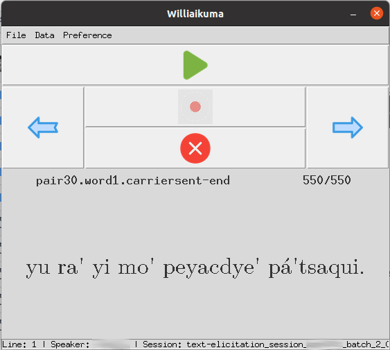
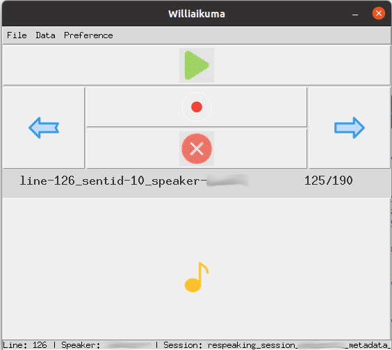

# Williaikuma

Williaikuma is a partial re-implementation of LIG-Aikuma (Gauthier et al., 2016), itself an extension of Aikuma (Bird et al., 2014). For now, **only text elicitation and respeaking modes** have been re-implemented.

Contrary to LIG-Aikuma, Williaikuma allows the user to freely go back and forth between sentences. Pre-filled Praat TextGrid files can also be generated for each recording.

Williaikuma was successfully tested in Bolivia in October and November 2022 to record 3+ hours of speech in Tsimane'. The application was used by 2 mildly computer-literate informants and by 1 non-computer literate informant.


# File format

## Text files

The format adopted for the elicitation files is the same as that of LIG-Aikuma, but with different semantics.
Each line should contain the sentence to be recorded by the speaker, seperated by the ID of the sentence. Sentence and IDs are separated by ` ## ` (i.e. space hash hash space). An exception will be raised if the elicitation files do not follow this format.

```
yu ra' yi mo' peyacdye' pá'tsaqui. ## pair30.word1.carriersent-end
yu ra' yi p̂oquí jeñej peyacdye'. ## pair32.word2.carriersent-middle
Vaj mequi'muntyi' isho'muntyi' in. ## pair23.word2.natsent
```
This sentence ID will be used to construct the filename of the recording. 

```
line-1_sentid-pair30.word1.carriersent-end_speaker-NAME.wav
line-2_sentid-pair32.word2.carriersent-middle_speaker-NAME.wav
line-3_sentid-pair23.word2.natsent_speaker-NAME.wav
```

with `NAME` being the name of the speaker of the current session. The line number of the sentence is also added to avoid any ambiguity.

See [`assets/examples/example_sentences.txt`](assets/examples/example_sentences.txt) for an example.

## Recordings

The default implementation allows to record **WAVE files** with 1 channel and a 44.1kHz sampling rate. These value can be changed by updating the values stored in [defaults.py](models/defaults.py)

# Requirements

Williaikuma use [PyAudio](https://pypi.org/project/PyAudio/) to record speech and [simpleaudio](https://pypi.org/project/simpleaudio/) to play the recordings back. PyAudio requires the installation of [ALSA](https://www.alsa-project.org/wiki/Main_Page) drivers. The application may also be run on Windows (untested, though).

See [lin-environment.yml](lin-environment.yml) (Linux) or [win-environment.yml](win-environment.yml) (Windows) for an extensive list of libraries to install (via conda).

# Screenshots




# Known issues

Random segmentation faults (on Linux) may occur if PyAudio fails to properly initialise ALSA drivers (via PortAudio).

# Citation

If you use this work for your own research, please use the following reference:

```bibtex
@inproceedings{havard:hal-03852211,
  TITLE = {{A study of the production and perception of ' in Tsimane'}},
  AUTHOR = {Havard, William and Scaff, Camila and Peurey, Loann and Cristia, Alejandrina},
  URL = {https://hal.archives-ouvertes.fr/hal-03852211},
  BOOKTITLE = {{Journ{\'e}es Jointes des Groupements de Recherche Linguistique Informatique, Formelle et de Terrain (LIFT) et Traitement Automatique des Langues (TAL)}},
  ADDRESS = {Marseille, France},
  EDITOR = {Becerra, Leonor and Favre, Beno{\^i}t and Gardent, Claire and Parmentier, Yannick},
  PUBLISHER = {{CNRS}},
  PAGES = {1-8},
  YEAR = {2022},
  KEYWORDS = {phonology ; perception ; production ; adapted lab experiments.},
  HAL_ID = {hal-03852211},
  HAL_VERSION = {v1},
}
```

# References

* Steven **Bird**, Florian R. Hanke, Oliver Adams, and Haejoong Lee. 2014. Aikuma: A Mobile App for Collaborative Language Documentation. In Proceedings of the 2014 Workshop on the Use of Computational Methods in the Study of Endangered Languages, pages 1–5, Baltimore, Maryland, USA. Association for Computational Linguistics.
* Elodie **Gauthier**, David Blachon, Laurent Besacier, Guy-Noel Kouarata, Martine Adda-Decker, et
al. LIG-AIKUMA: a Mobile App to Collect Parallel Speech for Under-Resourced Language Studies.
Interspeech 2016 (short demo paper), Sep 2016, San-Francisco, United States. 